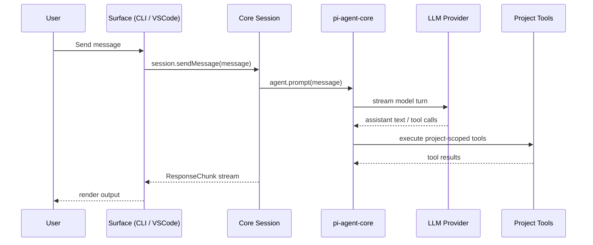

<div align="center">


<h1>Struggle AI</h1>

<h3>The Coding Mentor That Refuses to Be a Vending Machine</h3>
<h4>Vibe coders use AI as a vending machine — prompt in, code out, no understanding.<br>
Struggle AI helps you actually understand what is being written, why it works, and how to think through it yourself.</h4>


### Tech Stack

<p align="center">
  <a href="https://www.typescriptlang.org/">
    
  </a>
  <a href="https://nodejs.org/">
    
  </a>
  <a href="https://nextjs.org/">
    
  </a>
  <a href="https://biomejs.dev/">
    
  </a>
  <a href="https://vitest.dev/">
    
  </a>
  <a href="https://code.visualstudio.com/api">
    
  </a>
  <a href="https://opensource.org/licenses/MIT">
    
  </a>
</p>

</div>

---

<div align="center">


</div>

<div align="center">

<a href="docs/implementation-plan.md">
  
</a>
<a href="docs/development-guide.md">
  
</a>
<a href="docs/architecture.md">
  
</a>
<a href="docs/CONTRIBUTING.md">
  
</a>

</div>

---

## 📚 Explore Project Resources

Stay updated and dive deeper into the project!

- 🛠️ [**Development Guide**](docs/development-guide.md) — Repo workflow, package boundaries, and day-to-day commands.
- 🏗️ [**Architecture**](docs/architecture.md) — How core, CLI, and VS Code extension fit together.
- 📋 [**Master Plan**](docs/implementation-plan.md) — Full feature scope, ownership, and build timeline.
- 🤝 [**Contributing Guidelines**](docs/CONTRIBUTING.md) — Learn how to contribute and collaborate with us.

---

## 📋 Table of Contents

- [About Struggle AI](#-about-struggle-ai)
- [Why Struggle AI?](#-why-struggle-ai)
- [The Real Problem — Vibe Coders](#-the-real-problem--vibe-coders)
- [Three Friction Modes](#-three-friction-modes)
- [Key Features](#-key-features)
- [Architecture](#-architecture)
- [Project Structure](#-project-structure)
- [Getting Started](#-getting-started)
- [Git Workflow](#-git-workflow)
- [Development Workflow](#-development-workflow)
- [Testing](#-testing)
- [Team](#-team)
- [Contributing](#-contributing)
- [License](#-license)

---

## 🔎 About Struggle AI

**Struggle AI** is a Socratic coding mentor delivered as a **TypeScript monorepo** — available as a **CLI tool**, a **VS Code extension**, and backed by a **shared core library** that powers both surfaces.

It intercepts the moment between *"I have a problem"* and *"here is your code"* — filling that gap with structured reasoning, Socratic questions, comprehension checkpoints, and a Learning Trail that proves you actually understood what you built.

Built at the **Noverse FRICTION 2026 Hackathon** · *Apr 23–26, 2026* · 72 hours to ideate, build, and submit.

### 🚀 Key Highlights

- **Three friction modes** — Socratic, Guided, and Standard — each designed for a different level of cognitive challenge.
- **Socratic questioning engine** — decomposes your problem and makes you reason through it before giving you anything.
- **Explain-It-Back checkpoints** — you don't move forward until you can articulate what just happened.
- **Learning Trail** — an append-only comprehension log that tracks what you understood, not just what you built.
- **Understanding Score tracker** — a running measure of how deeply you are engaging with your own codebase.
- **CLI + VS Code** — meets you where you work, powered by the same shared core.

---

## 🔥 Why Struggle AI?

Every AI coding tool today optimises for the same thing — getting you to the answer faster.

- ❌ Answer delivered before you understand the problem.
- ❌ No feedback loop on whether you actually learned anything.
- ❌ Zero incentive to think before prompting.
- ❌ Codebases nobody on the team can reason about.
- ❌ Developers fluent in prompting, illiterate in their own stack.

**Struggle AI solves this** by putting the learning back in the loop:

- ✅ Decomposes your problem into sub-problems and asks you to reason through them.
- ✅ Generates only small code chunks after you demonstrate understanding.
- ✅ Forces an Explain-It-Back checkpoint before moving to the next milestone.
- ✅ Tracks your comprehension score and builds a persistent Learning Trail.
- ✅ Works across your terminal and VS Code — powered by the same shared core.

> *Struggle AI is not anti-AI. It is pro-understanding. It uses the model to ask better questions — not to skip yours.*

---

## 🧠 The Real Problem — Vibe Coders

There is a growing generation of developers who use AI as a **vending machine**.

They type a prompt. They get code. They paste it. It runs. They have **no idea what it does.**

```
// the vibe coder loop

prompt → copy → paste → "it works!" → repeat
                  ↑
                  no reading. no understanding. no learning.
```

This is not their fault. Every tool they use rewards speed over comprehension. The faster you ship, the better you feel — even if you could not explain a single line of what you just shipped.

**The result?**

- Codebases nobody on the team can reason about.
- Bugs nobody can debug because nobody understood the original logic.
- Developers who are fluent in prompting but illiterate in their own stack.

### What Struggle AI Does Differently

Struggle AI makes your brain do the work. Instead of handing you the answer, it makes you **earn it** — because the struggle is where understanding actually lives.

```
// the struggle AI loop

problem → decompose → question → reason → chunk unlocked → explain it back
                                    ↑
                                    this is where you actually learn
```

When you fight through a sub-problem, answer a Socratic question, or explain a concept back in your own words — **that is the moment it sticks.** Not the paste. The struggle.

Your Learning Trail is the proof — not just code history, but **comprehension history**.

> *A codebase you cannot explain is a codebase you do not own.*

---
### Workflow Diagram


## ⚙️ Three Friction Modes

Friction is not one-size-fits-all. You choose how much resistance you want per project.
Switch anytime with `/mode socratic | guided | standard`.

| Mode | Friction | The Flow |
| --- | --- | --- |
| **Socratic** | 🔴 High | Problem → 3–5 sub-problems → 2–3 Socratic questions each → evaluate answers → small code chunk unlocked → Explain-It-Back checkpoint → next sub-problem |
| **Guided** | 🟡 Medium | Design interview → AI writes the milestone → you answer a comprehension question → ADR auto-generated → next milestone |
| **Standard** | 🟢 Low | Brief design clarification → AI scaffolds code → mandatory digest → ADR auto-generated |

> Default on first launch: **Guided.** You are not thrown in the deep end — but you will have to think.

---

## ✨ Key Features

| # | Feature | CLI | VS Code |
| --- | --- | --- | --- |
| F1 | Three-mode friction selector | ✅ | ✅ |
| F2 | Intent classifier (`quick_help` / `debug` / `project`) | ✅ | ✅ |
| F3 | Design Interview state machine | ✅ | ✅ |
| F4 | Milestone loop with per-mode behavior | ✅ | ✅ |
| F5 | Sub-problem decomposition *(Socratic only)* | ✅ | ✅ |
| F6 | Explain-It-Back checkpoint | ✅ | ✅ |
| F7 | ADR auto-generation per module | ✅ | ✅ |
| F8 | "Concepts You Should Know" + "What Could Break" outputs | ✅ | ✅ |
| F9 | Real documentation URL allowlist (MDN, docs.python.org…) | ✅ | ✅ |
| F10 | Understanding Score tracker | ✅ | ✅ |
| F11 | Learning Trail — append-only comprehension log | ✅ | ✅ |
| F12 | Trail export to Markdown | ✅ | Stretch |
| F13 | `/share <path>` — user-pulled file context | ✅ | Auto |
| F14 | `/stuck` — 4-question diagnostic flow | ✅ | ✅ |
| F15 | `/hint` — graduated 3-level hints | ✅ | Stretch |

---

## 🏗 Architecture

Struggle AI is built around a **shared-core-first** model. All product logic lives in `packages/core` — consumed by every surface, implemented once.

```mermaid
flowchart LR
  User --> CLI[CLI App]
  User --> VSCode[VS Code Extension]
  CLI --> Core[@struggle-ai/core]
  VSCode --> Core
  Core --> Agent[pi-agent-core runtime]
  Agent --> LLM[LLM Providers via pi-ai]
  Core --> FS[IO abstraction — read/write/exists]
  Landing[Landing App] -. independent .- Core
```

### Runtime Flow



### IO Abstraction

Core never touches the filesystem or terminal directly. It depends on an injected `IO` interface — keeping it fully portable across every surface.

```ts
interface IO {
  readFile(path: string): Promise<string>
  writeFile(path: string, content: string): Promise<void>
  fileExists(path: string): Promise<boolean>
  notify(level: LogLevel, message: string): void
  stream(chunk: ResponseChunk): void
}
```

CLI → Node FS + terminal output &nbsp;|&nbsp; VS Code → `vscode.workspace.fs` + webview messages.

### 📂 Project Structure

```bash
struggle-ai/
├── packages/
│   ├── core/                   # @struggle-ai/core — shared domain + orchestration
│   │   └── src/
│   │       ├── coding-agent/   # session lifecycle, tools, prompt generation
│   │       ├── artifacts/      # Learning Trail renderer
│   │       ├── llm/            # pi-ai provider adapter
│   │       ├── gate/           # intent classifier
│   │       ├── prompts/        # prompt assets
│   │       ├── config.ts
│   │       ├── types.ts
│   │       └── index.ts        # ← stable public contract lives here
│   ├── cli/                    # @struggle-ai/cli — terminal interface
│   │   └── src/
│   │       ├── index.ts        # commander commands
│   │       └── repl.ts         # interaction layer + slash commands
│   └── vscode/                 # struggle-ai-vscode — VS Code extension
│       └── src/
│           ├── extension.ts    # activation + command registration
│           ├── panelHtml.ts    # webview markup
│           └── ioImpl.ts       # VS Code IO adapter
├── apps/
│   └── landing/                # Next.js marketing site (independent)
├── docs/
│   ├── architecture.md
│   ├── development-guide.md
│   └── implementation-plan.md
├── package.json                # npm workspaces root
└── tsconfig.json
```

---

## 🚀 Getting Started

Follow these steps to set up the project locally.

### Prerequisites

- **Node.js** 18+
- **npm** 9+ (workspaces support)
- An API key for your LLM provider — `ANTHROPIC_API_KEY`, `OPENAI_API_KEY`, or `GOOGLE_API_KEY`

### Local Setup

1. Clone the repository:
    ```bash
    git clone https://github.com/your-org/struggle-ai
    cd struggle-ai
    ```

2. Install all workspace dependencies:
    ```bash
    npm install
    ```

3. Verify the full workspace is healthy:
    ```bash
    npm run typecheck
    npm run check
    npm run build
    npm run test
    ```

    All four pass? You're ready.

4. Configure your LLM provider:
    ```bash
    npm exec --workspace @struggle-ai/cli struggle -- config set-provider anthropic
    npm exec --workspace @struggle-ai/cli struggle -- config show
    ```
    Config lives at `~/.struggle-ai/config.json`. Supported: `anthropic` · `openai` · `google`.

5. Run the CLI against a project:
    ```bash
    npm exec --workspace @struggle-ai/cli struggle -- --project /path/to/your/project
    ```

### Running the VS Code Extension

```bash
code packages/vscode
# Press F5 — launches the Extension Development Host
```

### Running the Landing Page

```bash
npm run dev:landing
# → http://localhost:3000
```

---

## 🌿 Git Workflow

This repo uses a simple staged flow — feature branches feed into `dev`, and `dev` promotes to `main`.

### Branch Flow

```text
main
  ^
  |
 dev
  ^
  |
feature/<name>
```

### 🔹 Starting Feature Work

Always branch from the latest `dev`:

```bash
git checkout dev
git pull origin dev
git checkout -b feature/short-description
```

Do your work, then commit using conventional commit messages:

```bash
git add .
git commit -m "feat: add session trail renderer"
git push -u origin feature/short-description
```

Open a pull request:
- **base branch:** `dev`
- **compare branch:** `feature/short-description`

### 🔹 Merging to `dev`

- Merge feature PRs into `dev` as the integration branch.
- Keep feature branches small and focused.
- Make sure all checks pass before merging.

### 🔹 Promoting `dev` → `main`

When `dev` is stable and ready for release:

```bash
git checkout dev
git pull origin dev
git push origin dev
```

Then open a pull request:
- **base branch:** `main`
- **compare branch:** `dev`

After that PR is reviewed and merged, `main` becomes the released baseline.

### 🔹 Rules

- Do not branch from `main` for normal feature work.
- Do not open feature PRs directly to `main`.
- Keep `main` protected and release-ready at all times.
- Sync your feature branch with `dev` if it gets stale.

### Quick Summary

```text
dev → create feature branch
feature branch → PR to dev
dev → PR to main
```

---

## 🛠️ Development Workflow

### 🔹 Daily Commands

```bash
npm run typecheck   # TypeScript project references check
npm run check       # Biome lint + format check
npm run format      # Auto-fix formatting
npm run build       # Build all workspaces
npm run test        # Run all Vitest suites
```

### 🔹 REPL Slash Commands

| Command | What it does |
| --- | --- |
| `/mode socratic` | Switch to high-friction Socratic mode |
| `/mode guided` | Switch to medium-friction Guided mode |
| `/mode standard` | Switch to low-friction Standard mode |
| `/share <path>` | Pull a file into the session context |
| `/stuck` | Trigger the 4-question diagnostic flow |
| `/hint` | Request a graduated hint (3 levels) |
| `/trail export` | Export your Learning Trail to Markdown |

### 🔹 Architecture Rules

These are not optional:

1. `packages/core` is **environment-agnostic** — no terminal, VS Code, or Node FS imports at runtime.
2. All cross-surface behavior lives in core first, then consumed by surfaces.
3. The stable public contract lives in `packages/core/src/index.ts` and `types.ts`.
4. Runtime-specific concerns stay in the caller package — never bleed into core.

---

## 🧪 Testing

Testing is critical for keeping both surfaces in sync — especially since both CLI and VS Code depend entirely on `packages/core`.

### 🔸 Tools Used

- **Vitest** for unit testing across all workspaces
- Lightweight passing suite per workspace to keep the toolchain wired

### 🔸 Running Tests

```bash
# All workspaces
npm run test

# Single workspace
npm run test --workspace @struggle-ai/core
```

### 🔸 Testing Strategy

- Add unit tests in the package that owns the logic.
- Keep core well-covered — both shells depend on it.
- Prefer fast unit tests over end-to-end suites during active iteration.

---

<div align="center">

## 🖌️ Team

*Built in 72 hours at **Noverse FRICTION 2026***

<table style="width: 90%;">
<tr>
<td align="center" width="25%">
<h4>Shafayetul Huda Sadi</h4>

<br><a href="https://github.com/Shafayetsadi"></a>
</td>
<td align="center" width="25%">
<h4>Mohammad Tanmoy Hossain Jifat</h4>

<br><a href="https://github.com/"></a>
</td>
<td align="center" width="25%">
<h4>Farhana Islam</h4>

<br><a href="https://github.com/"></a>
</td>
<td align="center" width="25%">
<h4>Arifur Rahman</h4>

<br><a href="https://github.com/"></a>
</td>
</tr>
</table>

</div>

---

## 🤝 Contributing

We welcome contributions!
Please read our [CONTRIBUTING.md](docs/CONTRIBUTING.md) for more information on how to get started.

- Use feature branches: `feature/your-feature-name`
- Follow conventional commit messages — e.g. `feat: add explain-it-back checkpoint`
- Always submit Pull Requests with clear descriptions and linked issues

---

## 📄 License

This project is licensed under the MIT License — see the [LICENSE](LICENSE) file for details.

---

<div align="center">

<br>

*Vibe coders ship code they cannot explain.*
*Struggle AI changes that — one struggle at a time.*

<br>

**// built at Noverse FRICTION 2026 · Stop removing it. Start understanding it.**

</div>