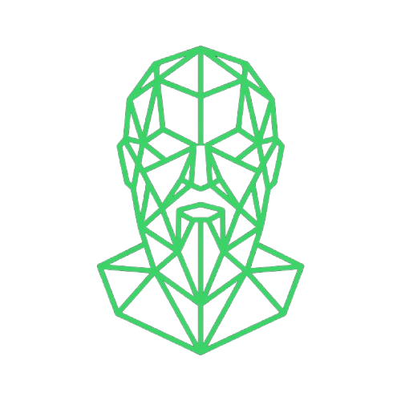
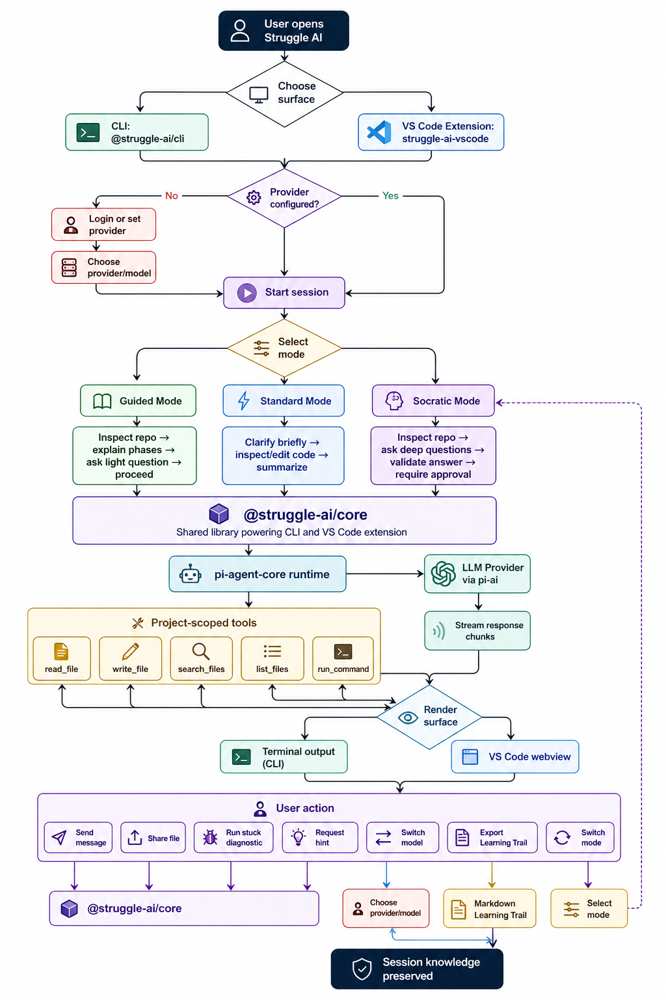
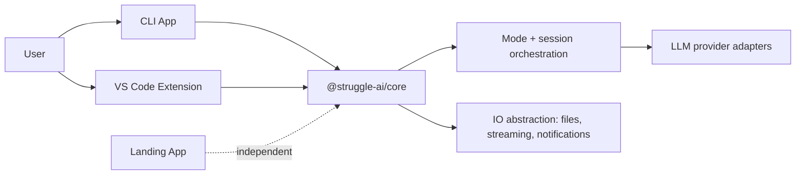
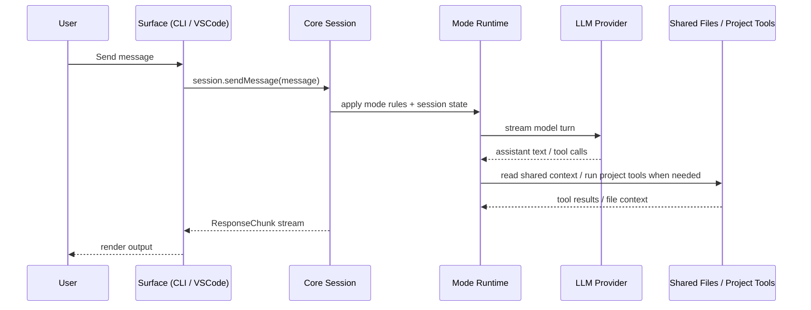

# Struggle-Code

<div align="center">


<h1>Struggle AI</h1>

<h3>Stop shipping code you can't explain.</h3>
<h4>We built Struggle AI around one belief: removing all friction from coding makes it easier to ship code you do not actually own.</h4>

</div>


## Tech Stack

<p align="center">
  <a href="https://www.typescriptlang.org/">
    
  </a>
  <a href="https://nodejs.org/">
    
  </a>
  <a href="https://biomejs.dev/">
    
  </a>
  <a href="https://vitest.dev/">
    
  </a>
  <a href="https://code.visualstudio.com/api">
    
  </a>
  <a href="https://opensource.org/licenses/MIT">
    
  </a>
</p>

---

## Table of Contents

- [The Crisis of Abstraction](#-the-crisis-of-abstraction)
- [Our Thesis](#-our-thesis)
- [Why This Fits FRICTION](#-why-this-fits-friction)
- [About Struggle AI](#-about-struggle-ai)
- [Think Before You Build](#-think-before-you-build)
- [Three Modes. One Goal: Understanding.](#-three-modes-one-goal-understanding)
- [The Learning Trail](#-the-learning-trail)
- [The Struggle Workflow](#-the-struggle-workflow)
- [Architecture](#-architecture)
- [For Developers](#-for-developers)
- [Team](#-team)
- [License](#-license)

---

## The Crisis of Abstraction

AI can write your code. But can you explain it?

That is the failure mode Struggle is built around. Too many tools optimize for instant output, leaving developers to curate magic boxes they cannot debug, extend, or defend later.

- ❌ Teams ship features faster, then stall when edge cases appear.
- ❌ Developers paste solutions they cannot reason about.
- ❌ Codebases become collections of generated answers instead of owned systems.
- ❌ Velocity goes up briefly, then collapses when understanding is missing.

> *A codebase you cannot explain is not productivity. It is dependency.*

---

## Our Thesis

We built **Struggle AI** to take a clear position on friction:

> **The best coding tools should not remove every obstacle. They should add deliberate cognitive friction at the moments where learning, ownership, and architectural clarity are at stake.**

In other words: we believe the current AI coding race is optimizing for speed at the cost of comprehension. Struggle is our argument that friction, used intentionally, can produce developers who understand what they ship instead of merely prompting it into existence.

---

## Why This Fits FRICTION

- **Interpretation** — We treat friction as a **cognitive and educational force**, not a mechanical slowdown.
- **Stance** — We are explicitly arguing that some friction in coding is not a bug. It is a feature.
- **Claim** — AI should not only generate code faster. It should make you worthy of owning the code you generate.

This is not a queue simulator, a slow UI gimmick, or a generic AI wrapper with the theme pasted on later. The friction is the product.

---

## About Struggle AI

**Struggle AI** is the response to that problem: the Socratic dialogue for developers, built to challenge your assumptions before it writes code.

Instead of behaving like a prompt-to-code vending machine, Struggle adds deliberate moments of resistance so you understand what you are building, why it works, and what trade-offs you just accepted.

This repo contains the full product stack: a **CLI**, a **VS Code extension**, a **landing page**, and the **shared core** that powers the learning workflow across those surfaces.

Built at the **Noverse FRICTION 2026 Hackathon** · *Apr 23–26, 2026* · 72 hours to ideate, build, and submit.

### Key Highlights

- **Deliberate cognitive friction** — Struggle slows you down only where understanding matters.
- **Question-first interaction** — it asks for trade-offs, constraints, and intent before moving to implementation.
- **Three learning modes** — Full Socratic, Guided, and Standard let you choose how much resistance you want.
- **Learning Trail artifacts** — every session can leave behind proof of understanding, decisions made, and context worth keeping.
- **Built for real developer workflows** — terminal-first, VS Code-ready, and backed by a shared TypeScript core.

---

## Think Before You Build

Struggle asks the right questions before writing code, so you understand what you are building instead of copying an answer you cannot explain later.

The core interaction is simple:

```text
You: Build me a rate-limiting middleware for Express.

Struggle: How should the system behave when a user exceeds the limit?
Should we return a 429 with a Retry-After header, silently drop requests,
or queue and delay them?

You: 429 with header. We need to be transparent with API consumers.
```

That extra friction is the point. Struggle forces architectural clarity before generation, then makes you explain the logic back in your own words so the implementation becomes yours, not just the model's.

## Three Modes. One Goal: Understanding.

Choose how much resistance you want. Every mode keeps understanding in the loop, but each one applies that pressure differently.

Switch anytime with `/mode socratic | guided | standard`.

| Mode | Friction | The Flow |
| --- | --- | --- |
| **Full Socratic** | High | Deep thinking. Struggle refuses to generate code until you can explain the architectural trade-offs behind the request. |
| **Guided** | Medium | Balanced by default. Struggle generates code alongside a Logic Map that explains the why behind major choices. |
| **Standard** | Low | Fast but reflective. Code comes quickly, but understanding is still checked before you can treat it as done. |

> Recommended starting point: **Guided**.

---

## The Learning Trail

Every session can produce a live project artifact that records what you learned, which decisions were made, and which trade-offs were accepted.

It is not just output history. It is the project's memory:

- **Proof of Understanding** — what you were able to explain back
- **Decision Logs** — why important choices were made
- **Context Awareness** — the constraints and assumptions behind the solution

That trail is the difference between generated code and owned code.

---

## The Struggle Workflow

Struggle keeps the loop short and explicit:

1. **Ask** — describe the problem in the CLI or VS Code extension.
2. **Think** — Struggle challenges your assumptions with clarifying questions.
3. **Build** — code is generated once you show architectural clarity.
4. **Export** — keep the implementation and the Learning Trail documentation.

The point of the demo is not that Struggle slows you down. The point is that it slows you down exactly where understanding would otherwise be skipped.

---

## Architecture

Struggle AI is built around a **shared-core-first** model. All product logic lives in `packages/core` — consumed by every surface, implemented once.

### Workflow Diagram



*Figure 1. End-to-end product flow across surface selection, provider setup, mode choice, shared core orchestration, and user actions.*



*Figure 2. High-level architecture: CLI and VS Code share the same core runtime, while the landing page remains a separate marketing surface.*

### Runtime Flow



*Figure 3. Runtime message loop: user input enters a surface, flows through core session and mode logic, optionally uses shared context/tools, then streams the response back to the user.*

### Project Structure

```bash
struggle-ai/
├── packages/
│   ├── core/                   # @struggle-ai/core — shared domain + orchestration
│   │   └── src/
│   │       ├── coding-agent/   # mode runtime, tools, prompt wiring
│   │       ├── session/        # shared session engine + state
│   │       ├── guided/         # guided-mode flow
│   │       ├── socratic/       # full-socratic flow
│   │       ├── standard/       # low-friction flow
│   │       ├── validation/     # answer-checking and scoring
│   │       ├── artifacts/      # Learning Trail and notes output
│   │       ├── llm/            # LLM provider adapters
│   │       ├── gate/           # intent classifier
│   │       ├── prompts/        # prompt assets
│   │       ├── config.ts       # provider + model config
│   │       ├── io.ts           # surface-agnostic IO contract
│   │       ├── types.ts        # shared public types
│   │       └── index.ts        # stable public exports
│   ├── cli/                    # @struggle-ai/cli — terminal interface
│   │   └── src/
│   │       ├── index.ts        # CLI entry + config commands
│   │       ├── repl.ts         # REPL bootstrap
│   │       ├── repl/           # slash commands, menus, terminal UI
│   │       ├── configStore.ts  # persisted auth/provider config
│   │       ├── ioImpl.ts       # terminal IO adapter
│   │       └── oauthLogin.ts   # provider login flow
│   └── vscode/                 # struggle-ai-vscode — VS Code extension
│       └── src/
│           ├── extension.ts    # activation + command registration
│           ├── panelHtml.ts    # webview markup
│           ├── ioImpl.ts       # VS Code IO adapter
│           └── cliProcess.ts   # extension-to-CLI bridge
├── apps/
│   └── landing/                # Next.js marketing site (independent)
├── docs/
│   ├── architecture.md
│   ├── development-guide.md
│   ├── modes.md
│   ├── manual-testing.md
│   ├── git-workflow.md
│   └── implementation-plan.md
├── package.json                # npm workspaces root
└── tsconfig.json
```

---

## For Developers

If you want to run the repo or inspect the implementation, start here:

- [docs/development-guide.md](docs/development-guide.md) — local setup, package boundaries, and day-to-day commands
- [docs/CONTRIBUTING.md](docs/CONTRIBUTING.md) — contribution workflow
- [docs/git-workflow.md](docs/git-workflow.md) — branch and release flow
- [docs/manual-testing.md](docs/manual-testing.md) — shared QA steps
- [docs/architecture.md](docs/architecture.md) — deeper technical notes

---
---

<div align="center">

## 🖌️ Team

*Built in 72 hours at **Noverse FRICTION 2026***

<table style="width: 90%;">
<tr>
<td align="center" width="25%">
<h4>Shafayetul Huda Sadi</h4>
<a href="https://github.com/Shafayetsadi"></a>
</td>
<td align="center" width="25%">
<h4>Mohammad Tanmoy Hossain Jifat</h4>
<a href="https://github.com/"></a>
</td>
<td align="center" width="25%">
<h4>Farhana Islam</h4>
<a href="https://github.com/"></a>
</td>
<td align="center" width="25%">
<h4>Arifur Rahman</h4>
<a href="https://github.com/"></a>
</td>
</tr>
</table>

</div>

---

## 📄 License

This project is licensed under the MIT License — see the [LICENSE](LICENSE) file for details.

---

<div align="center">

<br>

*Vibe coders ship code they cannot explain.*
*Struggle AI changes that — one struggle at a time.*

<br>

**// built at Noverse FRICTION 2026 · Stop removing it. Start understanding it.**

</div>
