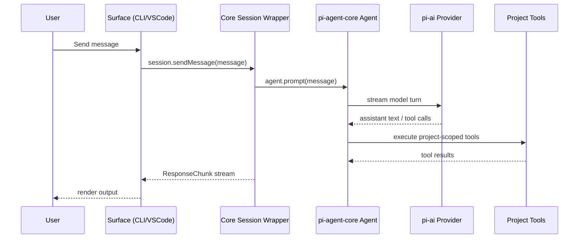

# Struggle AI Architecture

This document describes the current architecture of the Struggle AI monorepo and how the major parts interact.

For CLI usage details, see [packages/cli/README.md](/home/shafayetsadi/Projects/friction-hackathon/packages/cli/README.md).

## 1) Monorepo Structure

The repo uses **npm workspaces** with TypeScript project references.

- `packages/core` (`@struggle-ai/core`): shared domain + orchestration engine
- `packages/cli` (`@struggle-ai/cli`): terminal interface + command handling
- `packages/vscode` (`struggle-ai-vscode`): VS Code extension shell
- `apps/landing` (`landing`): Next.js marketing site

## 2) High-Level Architecture

```mermaid
flowchart LR
  User --> CLI[CLI App]
  User --> VSCode[VS Code Extension]
  CLI --> Core[@struggle-ai/core]
  VSCode --> Core
  Core --> Agent[pi-agent-core runtime]
  Agent --> LLM[LLM Providers via pi-ai]
  Core --> FS[IO abstraction read/write/exists]
  Landing[Landing App] -. independent .- Core
```

### Key boundary

`packages/core` is the product brain and is designed to be reused by multiple surfaces.
Runtime-specific concerns (terminal UI, VS Code APIs, local config file persistence) stay in caller packages.

## 3) Core Package (`packages/core`) Design

Core now centers on a `pi-agent-core` session wrapper plus a project-scoped tool set:

- `coding-agent/session.ts`: session lifecycle + `pi-agent-core` wrapper
- `coding-agent/tools.ts`: `read_file`, `write_file`, `list_files`, `search_files`, `run_command`
- `coding-agent/prompt.ts`: system prompt generation based on project path, mode, and shared files
- `artifacts/trail.ts`: Markdown trail rendering
- `llm/adapter.ts`: direct provider adapter over `@mariozechner/pi-ai` for helper APIs
- `gate/classifier.ts`: legacy intent helper still exported for compatibility
- `prompts/*`: prompt assets still used by helper flows outside the coding-agent runtime
- `config.ts`: provider resolution and config loading

### Core runtime model

- Entry point: `startSession(projectPath, io, config?)`
- Returns `Session` with APIs:
  - `sendMessage`
  - `setMode`
  - `shareFile`
  - `invokeStuck`
  - `invokeHint`
  - `exportTrail`
  - `getTrail`, `getADRs`
- Output is streamed as typed `ResponseChunk` variants.
- In the current coding-agent runtime, most output is emitted as `text` chunks summarizing tool activity and assistant responses.

### State model

Core maintains:

- public `SessionState` (id, mode, active milestone/sub-problem, understanding score, shared files)
- `pi-agent-core` message history and tool configuration
- trail entries for audit/history
- shared-file prompt context

## 4) IO and Environment Boundaries

Core depends on an injected `IO` interface:

- `readFile(path)`
- `writeFile(path, content)`
- `fileExists(path)`
- `notify(level, message)`
- `stream(chunk)`

This keeps core portable and allows each surface to control filesystem/UI behavior.

- CLI implements IO with Node FS + terminal output
- VS Code has an IO adapter using `vscode.workspace.fs` and webview messages

## 5) CLI Architecture (`packages/cli`)

CLI has two layers:

1. **Command layer** (`src/index.ts`)
   - `commander` commands (`struggle`, `config set-provider`, `config show`, `repl`)
   - reads/writes config at `~/.struggle-ai/config.json`
2. **Interaction layer** (`src/repl.ts`)
   - starts core session
   - parses slash commands (`/mode`, `/share`, `/stuck`, `/hint`, `/trail export`)
   - renders streamed response chunks in terminal
   - supports richer TUI and readline fallback

## 6) VS Code Extension Architecture (`packages/vscode`)

Current extension structure:

- `src/extension.ts`: activation + command registration + placeholder panel
- `src/panelHtml.ts`: webview markup
- `src/ioImpl.ts`: VS Code-backed `IO` adapter

Status: extension shell and Learning Trail view scaffold are present; full chat/session wiring to core is a next integration step.

## 7) Landing App Architecture (`apps/landing`)

- Next.js app-router based marketing site
- Separate deployment/runtime concerns from core/CLI/extension
- No runtime dependency on `@struggle-ai/core`

## 8) Primary Runtime Flow



## 9) Architectural Decisions

1. **Shared core-first model**
   - Behavior is implemented once in `packages/core` and consumed by multiple interfaces.

2. **Typed chunk protocol**
   - Surfaces render structured chunks instead of parsing free-form text.

3. **Project-scoped tool runtime**
   - The model interacts with the codebase through explicit file and shell tools constrained to the session project root.

4. **Prompt assets versioned in core**
   - Prompt templates are still part of source and copied during build for helper modules.

5. **Provider abstraction through pi-ai**
   - Provider selection is config-driven (`anthropic`, `google`, `openai`).

## 10) Known Gaps / Next Steps

- Wire the coding-agent session and tool feedback into the VS Code extension
- Optional true PDF export path (currently Markdown fallback)
- Add persistence strategy beyond per-session memory structures
- Expand testing around richer live tool-use scenarios and cross-surface behavior
