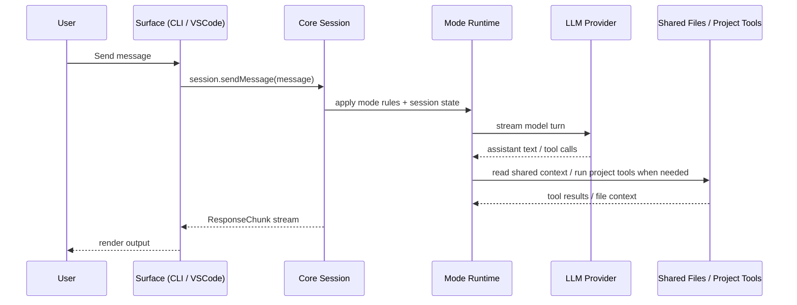

# Struggle AI Architecture

This document describes the current architecture of the Struggle AI monorepo and the boundaries between the major packages.

## Monorepo Overview

The repo uses npm workspaces with TypeScript project references.

- `packages/core` (`@struggle-ai/core`) is the shared product runtime
- `packages/cli` (`@struggle-ai/cli`) is the terminal surface
- `packages/vscode` (`struggle-ai-vscode`) is the VS Code surface
- `apps/landing` (`landing`) is the marketing site

## High-Level Architecture

```mermaid
flowchart LR
  User --> CLI[CLI App]
  User --> VSCode[VS Code Extension]
  CLI --> Core[@struggle-ai/core]
  VSCode --> Core
  Core --> Modes[Mode + session orchestration]
  Modes --> LLM[LLM provider adapters]
  Core --> IO[IO abstraction - files, streaming, notifications]
  Landing[Landing App] -. independent .- Core
```

Key boundary:

`packages/core` is the product brain. Runtime-specific concerns such as terminal rendering, VS Code APIs, and config persistence stay in the caller packages.

## Core Package Design

Core is organized around a shared session engine plus supporting modules:

- `session/` — session engine and state handling
- `coding-agent/` — mode-aware runtime, prompt generation, and tool integration
- `guided/`, `standard/`, `socratic/` — mode-specific flow helpers
- `validation/` — evaluation and scoring logic
- `artifacts/` — trail export, notes, and ADR artifacts
- `gate/` — intent classification
- `llm/` — provider adapter layer
- `prompts/` — versioned prompt markdown assets copied into `dist/prompts` on build

### Core contract

The stable public contract lives in:

- [packages/core/src/index.ts](/home/shafayetsadi/Projects/friction-hackathon/packages/core/src/index.ts)
- [packages/core/src/types.ts](/home/shafayetsadi/Projects/friction-hackathon/packages/core/src/types.ts)

The main entrypoint is `startSession(projectPath, io, config?)`, which returns a session object used by the CLI and the VS Code extension.

## Session Runtime Model

The runtime centers on:

- mode-aware session state
- shared file context
- streamed `ResponseChunk` output
- project-scoped tools for file and command access
- artifact generation for Learning Trail and ADR-related outputs

Important product/runtime boundary:

- user-shared context is tracked through shared files
- the model/runtime can use project-scoped tools during active session work
- mode behavior changes how planning, validation, and execution are surfaced to the user

## IO Boundary

Core depends on an injected `IO` interface so it stays portable across surfaces.

The interface includes:

- file reads
- file writes
- existence checks
- notifications
- streamed response chunks

This lets each surface own its own environment behavior:

- CLI uses Node filesystem and terminal output
- VS Code uses workspace/webview APIs

## CLI Architecture

The CLI has two main layers:

1. `src/index.ts`
   Handles command entry, config commands, provider/model operations, and auth-facing actions.
2. `src/repl.ts` plus `src/repl/`
   Handles the interactive session loop, slash commands, menus, and terminal UI behavior.

Notable CLI-owned concerns:

- config persistence in `~/.struggle-ai/config.json`
- OAuth credential persistence in `~/.struggle-ai/auth.json`
- REPL command discoverability and session ergonomics

## VS Code Extension Architecture

The extension is no longer just a placeholder shell. Its current structure includes:

- `src/extension.ts` — activation, panel lifecycle, command wiring, trail view refresh
- `src/panelHtml.ts` — webview markup and client-side UI shell
- `src/cliProcess.ts` — CLI daemon bridge and IPC wrapper
- `src/ioImpl.ts` — VS Code-backed IO adapter

Current interaction model:

- the extension starts a session through the CLI-backed daemon bridge
- streamed responses are forwarded into the webview
- the Learning Trail view is refreshed from session state/trail fetches

## Landing App Architecture

The landing app is independent from the core runtime.

- It communicates the thesis and product story
- It does not participate in CLI/extension session orchestration
- It should stay separate from core runtime concerns

## Runtime Message Flow



## Architectural Decisions

1. Shared core-first model
   Behavior is implemented once in `packages/core` and consumed by multiple surfaces.

2. Typed chunk protocol
   Surfaces render typed response chunks instead of scraping unstructured output.

3. Product-specific mode runtime
   Guided, Standard, and Socratic are runtime behaviors, not just marketing labels.

4. Versioned prompt assets
   Prompt markdown lives in source and is copied during build so runtime and docs stay aligned.

5. Separate marketing surface
   The landing page can evolve independently from the session runtime.

## Known Active Gaps

- deeper VS Code polish and richer UI iteration
- broader automated verification around live tool activity
- longer-term persistence beyond current session/trail artifacts
