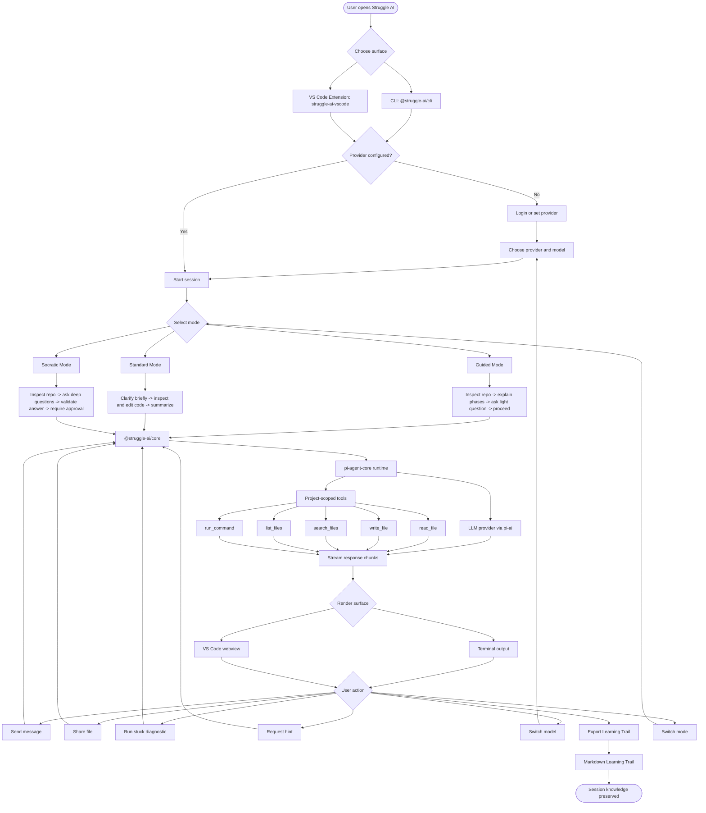

```mermaid
flowchart TD
  Start(["User opens Struggle AI"]) --> Surface{"Choose surface"}

  Surface --> CLI["CLI: @struggle-ai/cli"]
  Surface --> VSCode["VS Code Extension: struggle-ai-vscode"]

  CLI --> ConfigCheck{"Provider configured?"}
  VSCode --> ConfigCheck

  ConfigCheck -->|No| Login["Login or set provider"]
  Login --> ProviderSelect["Choose provider and model"]
  ProviderSelect --> SessionStart

  ConfigCheck -->|Yes| SessionStart["Start session"]

  SessionStart --> ModeSelect{"Select mode"}

  ModeSelect --> Guided["Guided Mode"]
  ModeSelect --> Standard["Standard Mode"]
  ModeSelect --> Socratic["Socratic Mode"]

  Guided --> GuidedFlow["Inspect repo -> explain phases -> ask light question -> proceed"]
  Standard --> StandardFlow["Clarify briefly -> inspect and edit code -> summarize"]
  Socratic --> SocraticFlow["Inspect repo -> ask deep questions -> validate answer -> require approval"]

  GuidedFlow --> Core["@struggle-ai/core"]
  StandardFlow --> Core
  SocraticFlow --> Core

  Core --> Agent["pi-agent-core runtime"]
  Agent --> Tools["Project-scoped tools"]
  Tools --> Read["read_file"]
  Tools --> Write["write_file"]
  Tools --> Search["search_files"]
  Tools --> ListFiles["list_files"]
  Tools --> Run["run_command"]

  Agent --> Provider["LLM provider via pi-ai"]
  Provider --> Stream["Stream response chunks"]

  Read --> Stream
  Write --> Stream
  Search --> Stream
  ListFiles --> Stream
  Run --> Stream

  Stream --> Render{"Render surface"}

  Render --> CLIOutput["Terminal output"]
  Render --> Webview["VS Code webview"]

  CLIOutput --> Actions{"User action"}
  Webview --> Actions

  Actions --> Send["Send message"]
  Actions --> Share["Share file"]
  Actions --> Stuck["Run stuck diagnostic"]
  Actions --> Hint["Request hint"]
  Actions --> Model["Switch model"]
  Actions --> Trail["Export Learning Trail"]
  Actions --> ModeAgain["Switch mode"]

  Send --> Core
  Share --> Core
  Stuck --> Core
  Hint --> Core
  Model --> ProviderSelect
  ModeAgain --> ModeSelect

  Trail --> TrailFile["Markdown Learning Trail"]
  TrailFile --> End(["Session knowledge preserved"])
```
