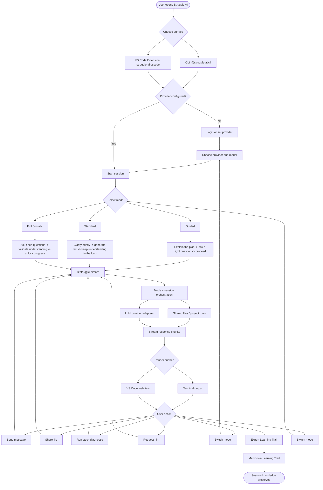

```mermaid
flowchart TD
  Start(["User opens Struggle AI"]) --> Surface{"Choose surface"}

  Surface --> CLI["CLI: @struggle-ai/cli"]
  Surface --> VSCode["VS Code Extension: struggle-ai-vscode"]

  CLI --> ConfigCheck{"Provider configured?"}
  VSCode --> ConfigCheck

  ConfigCheck -->|No| Login["Login or set provider"]
  Login --> ProviderSelect["Choose provider and model"]
  ProviderSelect --> SessionStart

  ConfigCheck -->|Yes| SessionStart["Start session"]

  SessionStart --> ModeSelect{"Select mode"}

  ModeSelect --> Guided["Guided"]
  ModeSelect --> Standard["Standard"]
  ModeSelect --> Socratic["Full Socratic"]

  Guided --> GuidedFlow["Explain the plan -> ask a light question -> proceed"]
  Standard --> StandardFlow["Clarify briefly -> generate fast -> keep understanding in the loop"]
  Socratic --> SocraticFlow["Ask deep questions -> validate understanding -> unlock progress"]

  GuidedFlow --> Core["@struggle-ai/core"]
  StandardFlow --> Core
  SocraticFlow --> Core

  Core --> Modes["Mode + session orchestration"]
  Modes --> Tools["Shared files / project tools"]
  Modes --> Provider["LLM provider adapters"]

  Tools --> Stream["Stream response chunks"]
  Provider --> Stream

  Stream --> Render{"Render surface"}

  Render --> CLIOutput["Terminal output"]
  Render --> Webview["VS Code webview"]

  CLIOutput --> Actions{"User action"}
  Webview --> Actions

  Actions --> Send["Send message"]
  Actions --> Share["Share file"]
  Actions --> Stuck["Run stuck diagnostic"]
  Actions --> Hint["Request hint"]
  Actions --> Model["Switch model"]
  Actions --> Trail["Export Learning Trail"]
  Actions --> ModeAgain["Switch mode"]

  Send --> Core
  Share --> Core
  Stuck --> Core
  Hint --> Core
  Model --> ProviderSelect
  ModeAgain --> ModeSelect

  Trail --> TrailFile["Markdown Learning Trail"]
  TrailFile --> End(["Session knowledge preserved"])
```
